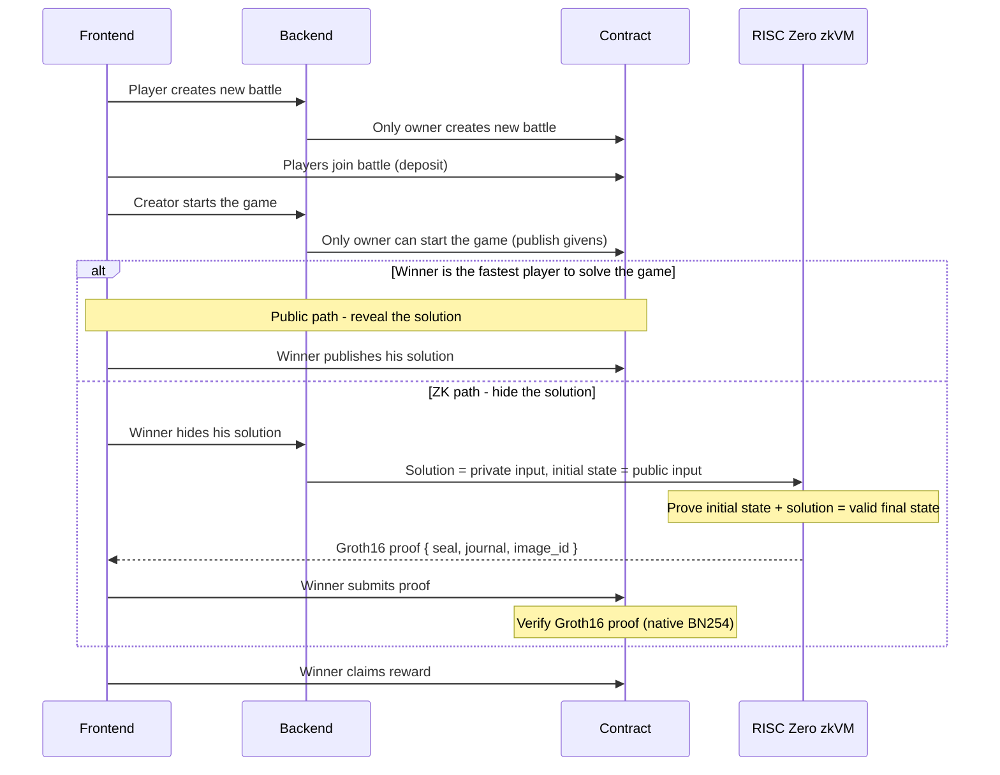

# ZKADE

> Prove you won. Without revealing how.

ZKADE is a zero-knowledge gaming arcade on **Stellar**. Players stake into a shared prize pool, race to solve a game, and the winner claims the entire pot - **and no server can fake a win or steal the pot, and no rival can copy the winning answer.**

Built for the [Stellar Hacks: Real-World ZK](https://dorahacks.io/hackathon/stellar-hacks-zk) hackathon.

---

## What it does

**The problem.** On-chain competitive games face a brutal tradeoff. Submit your solution publicly and every opponent watching the mempool can copy it and front-run your claim - your skill is worthless the instant you prove it. The alternative is trusting a centralized server to validate results off-chain - which throws away the entire point of being on-chain: now you trust an operator who can collude, stall, or lie.

**The solution.** The winner generates a **RISC Zero Groth16 proof** - cryptographic evidence that *"I know a valid solution"* without revealing what it is. A **Soroban** contract verifies that proof **on-chain** using Stellar's native **BN254** pairing functions (Protocol 25 "X-Ray"), and releases the pot the moment it checks out. No server can forge the result. The winning answer never goes on-chain. No judge to bribe.

The architecture is **game-agnostic**: any game whose winning condition can be expressed as a Rust program can be plugged in as a new RISC Zero guest. Sudoku is the first.

---

## Architecture

```
Browser ──Stellar Wallets Kit / Freighter──▶ sign Soroban invoke ──▶ Stellar testnet
   │
   ├─ solve puzzle locally (answer goes only to the prover, never on-chain)
   │
   └─ POST /api/v1/games/generate-proof ──▶ server (risc0-zkvm, Bonsai/local)
            └─ Groth16 receipt { seal, journal, image_id }
                 └─ submit_solution(seal) tx ──▶ sudoku contract
                          └─ cross-contract verify(seal, image_id, sha256(journal))
                                   └─ RISC Zero Groth16 verifier (native BN254) ──▶ ✓ / revert
```

### Game lifecycle



The sudoku contract **reconstructs the proof's journal from the room's stored puzzle givens**, hashes it, and passes that digest to the verifier. This binds each proof to a specific puzzle - a proof for one room cannot be replayed in another, and `image_id` pins proofs to *our* guest program.

---

## Stack

| Component   | Tech                                                              | Location          |
|-------------|-------------------------------------------------------------------|-------------------|
| Frontend    | Next.js 15, Tailwind, Stellar Wallets Kit + Freighter, `@stellar/stellar-sdk` | `frontend/`       |
| Backend     | Rust, Axum, `risc0-zkvm` (Bonsai / local proving)                 | `server/`         |
| Game contract | Soroban (`soroban-sdk` 26), on Stellar testnet                  | `soroban/`        |
| ZK verifier | RISC Zero Groth16 verifier (BN254), vendored from [NethermindEth/stellar-risc0-verifier](https://github.com/NethermindEth/stellar-risc0-verifier) (Apache-2.0) | `risc0-verifier/` |
| ZK program  | RISC Zero zkVM guest (RISC-V, Groth16), image v3.0                | `games/sudoku/`   |

---

## Deployment (Stellar testnet)

See `soroban/deployment.json`.

| Contract            | Address                                                      |
|---------------------|--------------------------------------------------------------|
| Sudoku game         | `CAR43CM6OX2D7CFDSMY74R2B2QEA56CKGVUN32JSY3MY364LMGD6PGYM`     |
| RISC Zero verifier  | `CCEV7GX4QCM4HUOD4LSRW4IW2HS3PCY2EA5FS43FWC5Q6ZHTYDGRHCCD`     |
| Reward token        | native XLM SAC (`CDLZFC3SYJYDZT7K67VZ75HPJVIEUVNIXF47ZG2FB2RMQQVU2HHGCYSC`) |

---

## Prerequisites

- Node.js 18+, pnpm
- Rust + `cargo`, with the `wasm32v1-none` target (`rustup target add wasm32v1-none`)
- [Stellar CLI](https://github.com/stellar/stellar-cli) (`stellar`)
- RISC Zero toolchain: `curl -L https://risczero.com/install | bash && rzup install`
- Docker (for local Groth16 proving - x86_64)
- [Freighter](https://www.freighter.app/) browser wallet (testnet enabled)

---

## Setup

### 1. Install

```bash
git clone <repo> && cd stellar-zkade
cd frontend && pnpm install && cd ..
```

### 2. Deploy contracts to testnet

```bash
cd soroban && ./deploy.sh        # funds a key via Friendbot, deploys verifier + game
                                 # writes addresses to soroban/deployment.json
```

### 3. Configure environment

**`server/.env`** (copy from `.env.example`) - set `GAME_CONTRACT` to the deployed sudoku id and `GAME_OWNER` to your funded `stellar` identity. Optionally set `BONSAI_API_KEY` / `BONSAI_API_URL` for hosted proving (else proves locally).

**`frontend/.env.local`** (copy from `.env.example`) - set `NEXT_PUBLIC_SUDOKU_CONTRACT` and `NEXT_PUBLIC_GAME_OWNER`.

### 4. Run

```bash
# Terminal 1 - backend
cd server && cargo run

# Terminal 2 - frontend
cd frontend && pnpm dev
# open http://localhost:3000
```

---

## How the round works

1. **Create & join** - the owner (server) creates a room; players join by depositing the entry fee (XLM) into the contract.
2. **Start** - the owner publishes the puzzle givens on-chain.
3. **Solve** - players solve locally; the solution is sent only to the prover to build the proof, never published on-chain or shown to opponents.
4. **Prove** - the first solver locks themselves as winner, then the server generates a RISC Zero Groth16 proof of their solution.
5. **Verify** - the player submits the proof; the contract cross-contract-verifies it on-chain (native BN254 pairing).
6. **Claim** - the verified winner sweeps the prize pool.

A public (reveal-the-answer) path is also available as a fallback.

---

## Honest limitations

What is **trustless today** is the part that holds your money: fund custody, proof verification, and reward release all happen on-chain. No server can fake a win or steal the pot, and the winning answer is never published on-chain. That said, this is a hackathon build and it is not yet fully decentralized:

- **A trusted coordinator still runs the round.** A server (the contract owner) creates rooms, generates the puzzle, and locks the winner. It *can't* steal funds or forge a win - the contract and the proof prevent that - but it *could* censor, stall, or pre-solve the puzzle it hands out. So "no trusted server" holds for *verification and custody*, not yet for *coordination*; permissionless rooms and on-chain puzzle generation are the natural next steps.
- **Proof generation is off-chain, and the prover sees your solution.** A Groth16 proof takes ~1–2 minutes and needs real compute (Bonsai, or a local/remote prover with x86_64 + Docker) - it cannot run in a browser. Because the prover *builds* the proof, it necessarily receives your plaintext solution, so it is trusted for **privacy**. It still can't forge a win or move funds (every proof is verified on-chain, and anyone can run their own prover), and the answer is never published on-chain or shown to opponents - but the answer is not hidden from the prover itself.
- **Testnet, unaudited.** Runs on Stellar testnet with test XLM. The contract has unit tests (including journal byte-equality against the real guest) but no formal audit, and proofs are pinned to a specific `image_id` and a matching `risc0-zkvm` 3.0.x toolchain.

---

## Build & test

```bash
# RISC Zero guest + host (dumps image_id / journal; `prove` for a full Groth16 proof)
cd games/sudoku && cargo run -p sudoku-host          # add `-- prove` for a real proof

# Soroban contract unit tests (mocked verifier + journal byte-equality vs. real guest)
cd soroban && cargo test -p sudoku

# Contracts → wasm
cd soroban && stellar contract build

# Frontend
cd frontend && pnpm build
```
